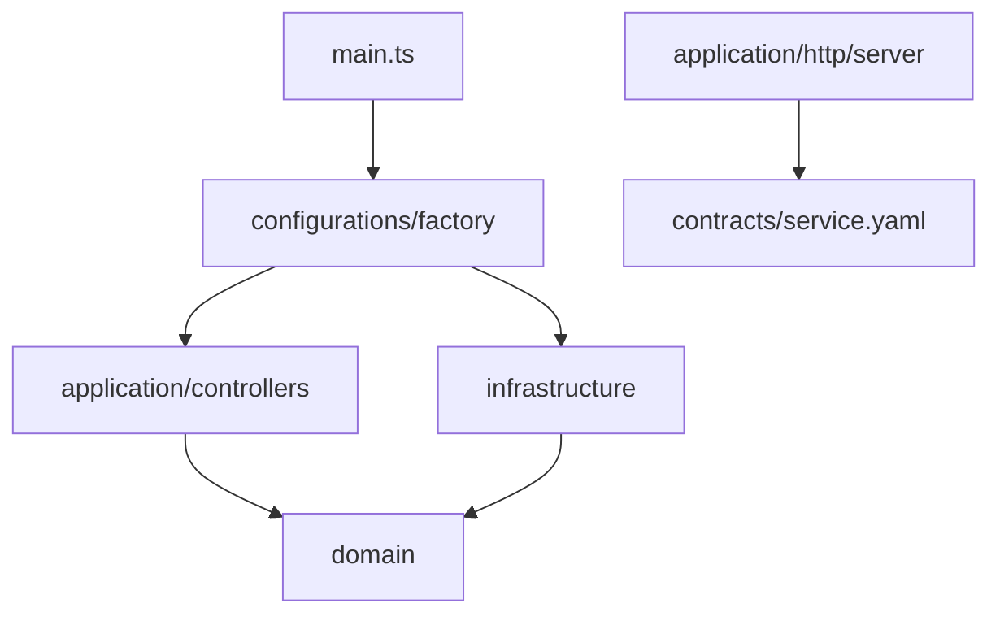
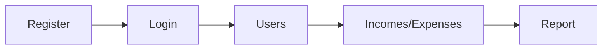

# finance-api

API REST de finanças pessoais — usuários, receitas, despesas e relatórios.
Backend only, construído com Express 5, MongoDB e TypeScript.

## Produto

**O que é?** Uma API para registrar receitas e despesas, gerenciar titular e
dependentes, e gerar relatórios por período. Não há frontend — o foco é o backend.

**Qual problema resolve?** Organizar lançamentos financeiros de uma família ou
unidade doméstica com papéis distintos: o titular gerencia tudo; o dependente
registra e consulta apenas o próprio.

**Para quem serve?** Primariamente, quem avalia o autor como engenheiro (portfólio,
entrevista). No domínio, um titular de finanças domésticas via API — escopo
deliberadamente pequeno: uma instância da API = um titular e seus dependentes.

## Técnica

### Stack

| Camada | Tecnologia |
|--------|------------|
| Runtime | Node.js, TypeScript (ESM) |
| HTTP | Express 5 |
| Persistência | MongoDB + Mongoose |
| Auth | JWT + bcrypt |
| Contrato | OpenAPI 3 (`express-openapi-validator`) |
| Testes | Jest, Supertest, mongodb-memory-server |

### Estrutura

- **src/domain** — Entidades, contratos de repository/service, erros (`DomainError`,
  `EErrorCode`) e helpers puros. Sem Express, Mongoose ou HTTP.
- **src/application** — Controllers HTTP (`IController` + `initRoutes`), middlewares
  (JWT, ObjectId) e servidor Express.
- **src/infrastructure** — MongoDB (schemas, models, repos, mappers), JWT/bcrypt e
  i18n de erros.
- **src/configurations** — Variáveis de ambiente e **factories** (composition root).
- **src/contracts** — [`service.yaml`](./src/contracts/service.yaml) (OpenAPI): documenta
  e valida requests em runtime.
- **src/__tests__** — Testes unitários (`unit/`) e de integração E2E (`integration/`).
- **main.ts** — Conecta ao MongoDB, instancia controllers via factories e sobe o servidor.



### Como executar

1. Instale as dependências:

```bash
yarn install
```

2. Crie um `.env` a partir do exemplo:

```bash
cp .env.example .env
```

| Variável | Descrição |
|----------|-----------|
| `MONGODB_URI` | URI de conexão com o MongoDB |
| `PORT` | Porta HTTP (ex.: `3000`) |
| `JWT_SECRET` | Segredo para assinatura dos tokens JWT |
| `JWT_EXPIRATION` | Tempo de expiração do token (ex.: `1d`) |
| `BCRYPT_SALT_ROUNDS` | Rounds do bcrypt para hash de senha |

É necessário ter um MongoDB acessível na URI configurada (local ou remoto).

3. Desenvolvimento:

```bash
yarn dev
```

4. Build e produção:

```bash
yarn build
yarn start
```

5. Testes:

```bash
yarn test:unit   # schemas e domínio (*.unit.test.ts)
yarn test:int    # endpoints E2E com MongoDB em memória (*.int.test.ts)
yarn test        # unit + integração
```

## Engenharia

### Decisões

| Decisão | Por quê |
|---------|---------|
| Clean Architecture / camadas rígidas | Domínio testável sem Express/Mongoose; trocar infra sem reescrever regras |
| Dois contratos por feature (`*.interface.ts` + `*.service.interface.ts`) | Separa persistência de casos de uso; evita DTOs de login no agregado |
| OpenAPI como fonte de verdade **e** validação em runtime | Documentação não diverge do comportamento real |
| Autorização no **service**, não só no middleware | Anti-IDOR via `assertResourceAccess` — titular vs dependente |
| Credenciais em port (`IUserCredentialsPort`) | Repository read nunca expõe senha/hash |
| Registro público só para o 1º titular | Single-tenant por instância; dependentes só via titular autenticado |
| Factories como composition root | `main.ts` só conecta DB e registra controllers |
| [AGENTS.md](./AGENTS.md) + rules Cursor | Governança explícita; reduz drift arquitetural |

### Padrões

- Repository read/write separados por agregado
- `DomainError` + `EErrorCode` no domínio; tradução na infra (`ErrorCatalog`, `Accept-Language`)
- Controllers finos: parse HTTP → service → `handleTranslatedError`
- Enums de entidade no `*.interface.ts` do agregado (nunca `domain/common/enums/`)

### Trade-offs

| Escolha | Ganho | Custo / limite |
|---------|-------|----------------|
| MongoDB document-oriented | Agilidade; schemas alinhados ao domínio | Relatórios agregam em memória |
| Single titular por instância | Auth simples e testável | Não é multi-tenant |
| OpenAPI valida só requests | Menos acoplamento response ↔ spec | Responses não validadas automaticamente |
| Sem paginação/filtros | CRUD direto, código enxuto | Não escala para milhares de lançamentos |
| Relatório via `POST /api/reports` | Body tipado no OpenAPI | Recalcula a cada request |
| Backend only | Foco em API e arquitetura | Incompleto para usuário final sem client |

## Qualidade

### Testes

| Camada | O quê | Onde | Qtd. |
|--------|-------|------|------|
| Unit | Schemas Mongoose, helpers (`date`, `access`), `ReportService` | `src/__tests__/unit/` | 6 |
| Integração E2E | Register, login, CRUD income/expense, reports | `src/__tests__/integration/` | 6 |
| Segurança | IDOR, papéis, registro fechado, auth | `src/__tests__/integration/security/` | 3 |

Antes de merge: `yarn build && yarn test:unit && yarn test:int`. Endpoint novo com
`:id` → incluir teste de ownership em `security/`.

### Validações

- Request body/path contra [`service.yaml`](./src/contracts/service.yaml)
  (`additionalProperties: false`)
- ObjectId inválido → middleware dedicado
- Domínio: datas brasileiras (`DD/MM/AAAA`), intervalos de relatório, enums de
  status e método de pagamento

### Tratamento de erro

- Domínio lança `DomainError(EErrorCode, status)` — sem Express no domain
- Application captura → `handleTranslatedError` → mensagem em pt-BR / en / es
- Login: email inexistente e senha errada → mesmo código (`401`) — anti-enumeration
- Rate limit em `/api/users/login` e `/api/users/register`

## Evolução

### O que já foi entregue

Fluxo end-to-end implementado e testado:

1. **Bootstrap** — primeiro titular via `POST /api/users/register`; tentativas
   seguintes retornam `403`.
2. **Autenticação** — `POST /api/users/login` retorna JWT; rotas protegidas exigem
   `Authorization: Bearer <token>`.
3. **Gestão de pessoas** — titular cria dependentes (`POST /api/users`), lista
   (`GET /api/users`), consulta/atualiza/remove por id (`GET/PUT/DELETE /api/users/:id`).
4. **Receitas** — titular cria e lista (`POST/GET /api/incomes`); titular ou dono
   consulta/edita (`GET/PUT /api/incomes/:id`); titular remove (`DELETE /api/incomes/:id`).
5. **Despesas** — mesmo padrão em `/api/expenses`.
6. **Relatórios** — `POST /api/reports` com `type`: `income`, `expense` ou `profit`
   e intervalo de datas; escopo = usuário do JWT.
7. **Health** — `GET /api/health`.



Papéis: `USER` (titular) e `DEPENDENT` (dependente). Payloads completos em
[`src/contracts/service.yaml`](./src/contracts/service.yaml).

### Rotas (índice)

| Método | Rota | Quem | O que faz |
|--------|------|------|-----------|
| GET | `/api/health` | — | Health check |
| POST | `/api/users/register` | — | Registra o 1º titular |
| POST | `/api/users/login` | — | Autentica e retorna JWT |
| POST | `/api/users` | Titular | Cria dependente |
| GET | `/api/users` | Titular | Lista usuários |
| GET | `/api/users/:id` | Titular ou self | Consulta usuário |
| PUT | `/api/users/:id` | Titular | Atualiza usuário |
| DELETE | `/api/users/:id` | Titular | Remove usuário |
| POST | `/api/incomes` | Titular | Cria receita (opcional `userId`) |
| GET | `/api/incomes` | Titular | Lista receitas |
| GET | `/api/incomes/:id` | Titular ou dono | Consulta receita |
| PUT | `/api/incomes/:id` | Titular ou dono | Atualiza receita |
| DELETE | `/api/incomes/:id` | Titular | Remove receita |
| POST | `/api/expenses` | Titular | Cria despesa (opcional `userId`) |
| GET | `/api/expenses` | Titular | Lista despesas |
| GET | `/api/expenses/:id` | Titular ou dono | Consulta despesa |
| PUT | `/api/expenses/:id` | Titular ou dono | Atualiza despesa |
| DELETE | `/api/expenses/:id` | Titular | Remove despesa |
| POST | `/api/reports` | JWT (escopo do token) | Gera relatório por período |

### O que falta

- Frontend ou client consumidor
- CI/CD (não há `.github/workflows` hoje)
- Paginação, filtros, categorias, exportação
- Multi-tenant (vários titulares na mesma instância)
- Observabilidade avançada (métricas, tracing, logs estruturados)
- Cache ou fila para relatórios pesados

### Como escalar

- **Horizontal:** API stateless + MongoDB replicado; JWT sem sessão server-side
- **Dados:** índices em `user` + datas; paginação cursor-based; agregações MongoDB nos relatórios
- **Produto:** multi-tenant com `tenantId` no JWT e isolamento no repository
- **Qualidade:** CI com `build + test`; contract tests de response; load test nos relatórios
- **Operação:** health + readiness; secrets via env/vault; rate limit por IP/user

## Profissional

Este repositório prioriza **manutenibilidade** sobre escopo de produto: governança
escrita ([AGENTS.md](./AGENTS.md)), separação de concerns que facilita onboarding,
testes de segurança junto com CRUD, trade-offs documentados e caminho claro para
evoluir sem reescrever do zero.

### Adicionando novos recursos

1. Defina entidades e interfaces em `src/domain`:
   - `entity/interfaces/<feature>.interface.ts` — persistência (`E*`, `I*`, `IParamsCreate*`)
   - `entity/interfaces/<feature>.service.interface.ts` — casos de uso (`I*Service`, fluxos)
   - entidade, contratos de repository e service
2. Crie implementações em `src/infrastructure` (schema, model, mapper, repos).
3. Registre dependências em `src/configurations/factory/` (service + controller).
4. Exponha rotas em `src/application/<feature>.controller.ts` com `initRoutes()`.
5. Registre o controller em `src/main.ts`.
6. Documente rotas e schemas em `src/contracts/service.yaml`.
7. Escreva testes: unitário de schema (`*.unit.test.ts`) e integração (`*.int.test.ts`).

### Antes de contribuir

Leia **[AGENTS.md](./AGENTS.md)** — contrato de camadas, dependências, nomenclatura,
enums, segurança e testes para humanos e agentes de IA.
